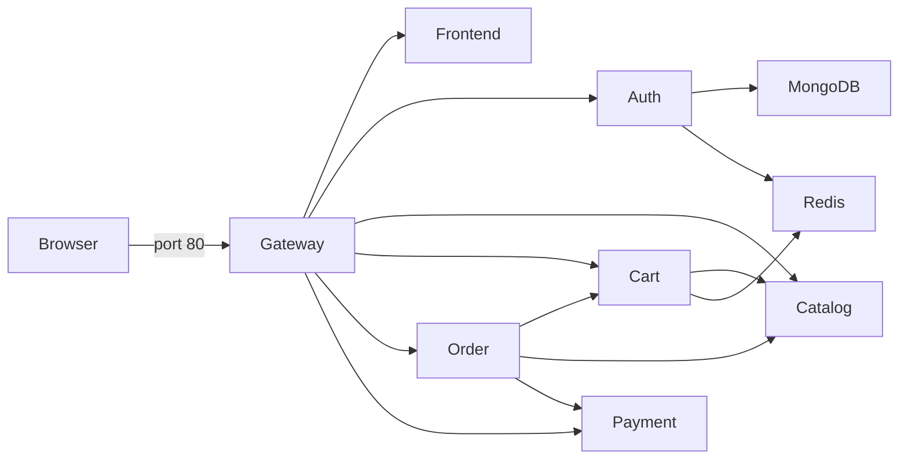

# Sports Store Local Environment

Docker Compose orchestration for running the entire Sports Store on one development machine.

## What it starts

MongoDB, Redis, the five Python backend services, the React frontend, and the NGINX gateway share the `sports-store-net` bridge network. Only the gateway publishes a host port (`80`), so users reach both the UI and APIs at `http://localhost`.



## Prerequisites and repository layout

Install Git and Docker Desktop (or Docker Engine with Compose v2). Clone all component repositories as siblings; Compose build paths depend on these exact directory names:

```text
parent/
├── sports-store-local/
├── sports-store-auth-service/
├── sports-store-catalog-service/
├── sports-store-cart-service/
├── sports-store-order-service/
├── sports-store-payment-service/
├── sports-store-frontend/
└── sports-store-gateway/
```

`docker-compose.yml` defines services and health checks, `seed/init-mongo.js` creates first-start data, and `.env.example` documents Compose variables.

## Start, inspect, and stop

From this repository:

```bash
cp .env.example .env                  # PowerShell: Copy-Item .env.example .env
docker compose config                 # Validate and expand the configuration
docker compose up --build -d          # Build and start in the background
docker compose ps                     # Show readiness
docker compose logs -f gateway order  # Follow selected logs
docker compose down                   # Stop containers; keep MongoDB data
```

Open `http://localhost`. To remove the named MongoDB volume as well, run `docker compose down --volumes`; this permanently deletes local database data.

## Configuration

| Variable | Purpose |
| --- | --- |
| `MONGO_ROOT_PASSWORD` | Local MongoDB administrator password |
| `JWT_SECRET` | Shared JWT signing/verification secret |
| `PAYMENT_FAILURE_SUFFIX` | Card suffix that produces a deliberate mock decline |

Change the example values when the environment is shared. `OPENROUTER_*` applies only to optional GitHub review automation and is not passed to application containers.

## Validation and CI

```bash
docker compose config
docker compose build
```

The `PR Quality and Security` workflow validates branch names, parses Compose configuration, and scans secrets. The separate post-CI workflow and reusable workflow support the optional reviewer. Application unit tests remain in their owning repositories.

## Troubleshooting and limitations

- Port `80` must be free. Stop the conflicting server or change the gateway port mapping locally.
- If a build context is missing, check the sibling directory names above.
- If a service remains unhealthy, use `docker compose ps` and `docker compose logs <service>`; dependent services wait for health checks.
- MongoDB seed scripts run only when the data volume is first created. Re-seeding requires intentionally deleting the local volume.
- This setup uses standalone Redis, while production uses Redis Sentinel through [sports-store-deployments](https://github.com/Deploy-On-Friday2-0/sports-store-deployments).
- Never reuse the example secrets in production. Follow [CONTRIBUTING.md](CONTRIBUTING.md) for changes.
